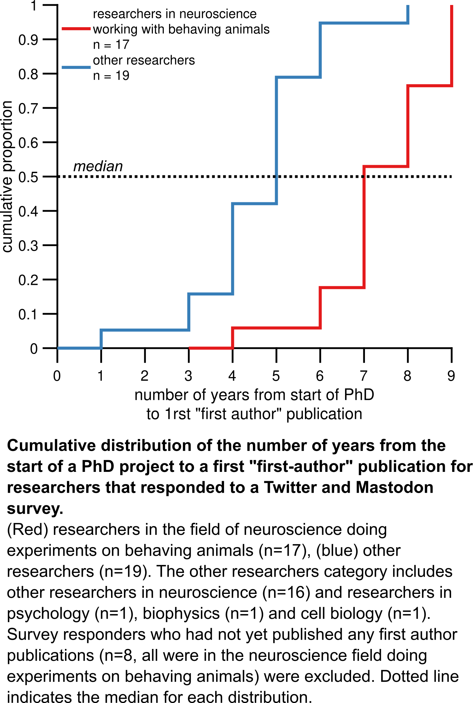

## number of years to publication in systems neuroscience (experiments on live animals) vs other fields

Code and analysis outcome of an ongoing survey ([link](https://forms.gle/GksUQMKiKsKwq8it7)) looking at the time it takes to publish in different fields. As a proxy for publication time throughout the field, we are using the time it takes to publish a first "first-author" paper during a PhD.

Please participate and share the survey link if you're interested! If the survey gets bigger, we will release more detailed information on fields outside of neuroscience too. 

