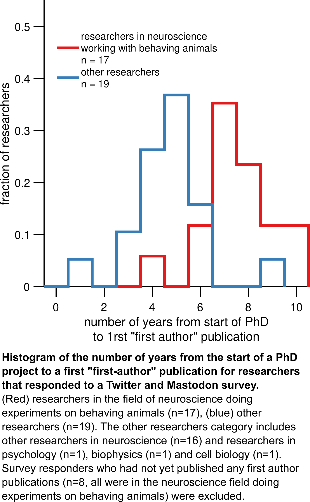

##

Code and analysis outcome of an ongoing survery (link) looking at the time it takes to publish in different fields. As a proxy for publication time throughout the field, we are using the time it takes to publish a first "first-author" paper during a PhD.

